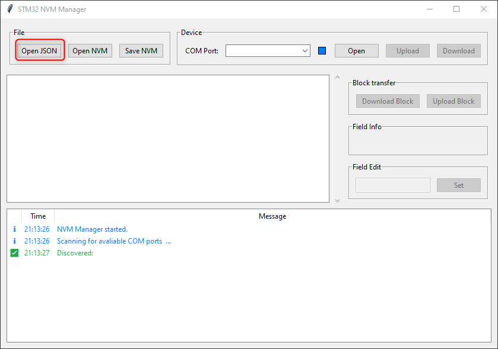
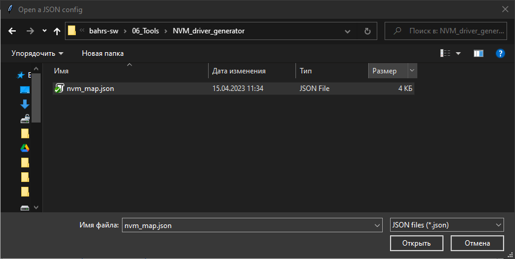
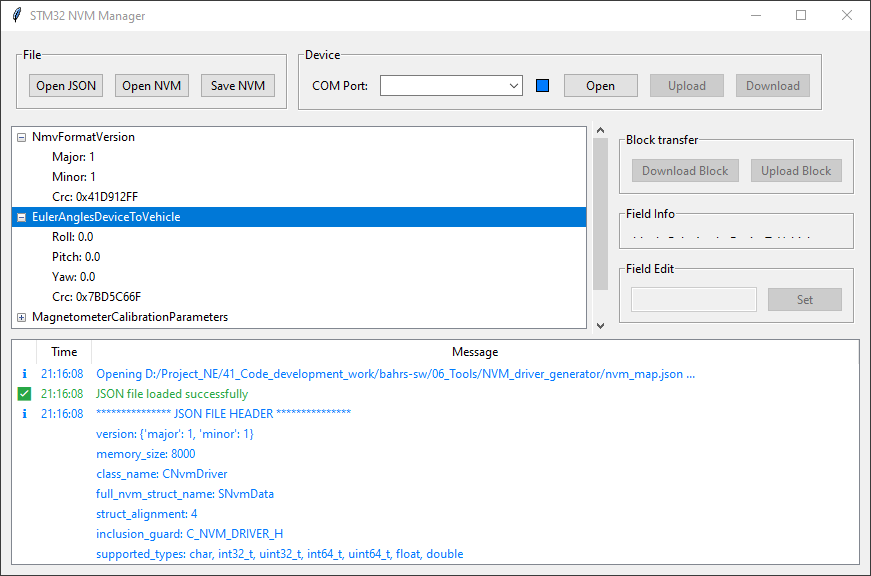
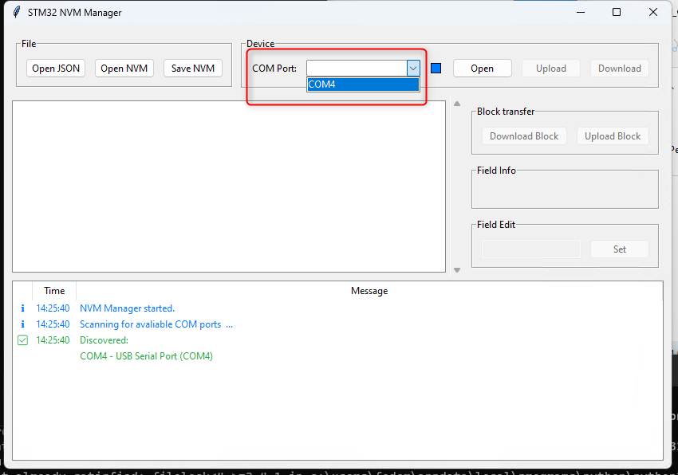
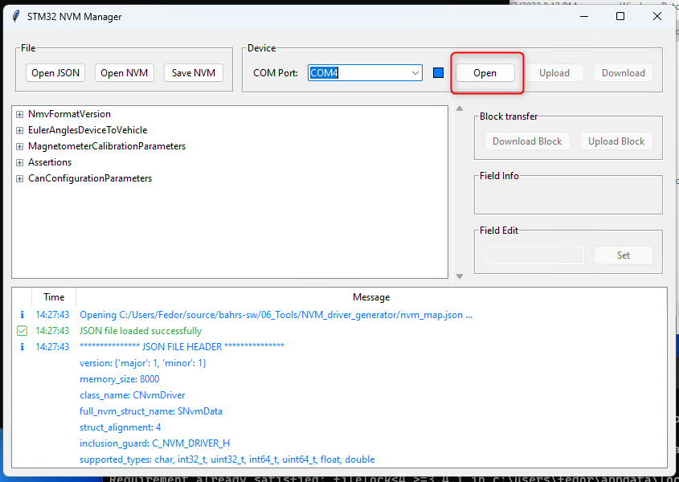
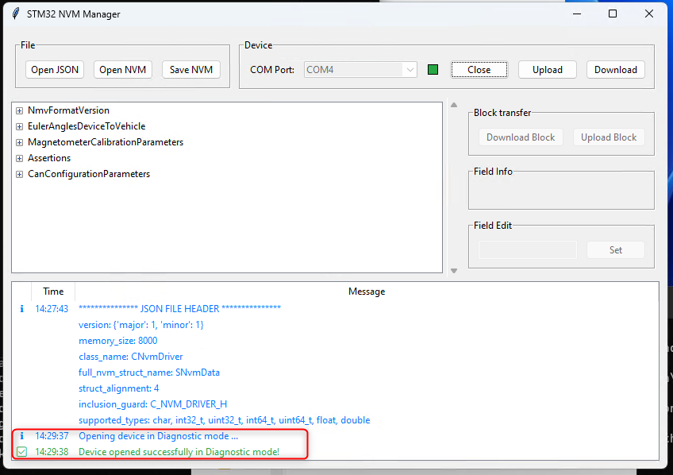
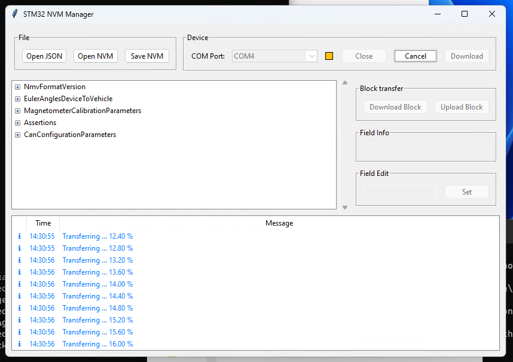
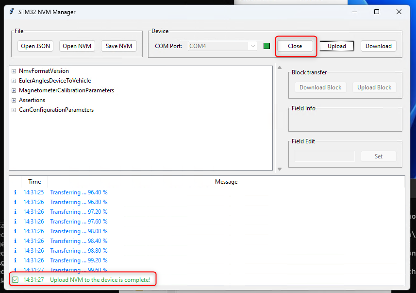

# Introduction to NVMManager

## Purpose

The NVMManager has the following functions:

1. Create default images of device's non-volatile memory (NVM)
2. Edit parameters in the existing binary images
3. Upload NVM images to device's NVM
4. Edit parameters in device's NVM

## Installation

### Preconditions

1. Python 3.11 needs to be installed on your PC
2. *python.exe* needs to be on the system path
3. *pipenv.exe* needs to be on the system path
4. pip is installed

### First time installation

- run *install_pipenv.bat*

### Update virtual environment

Needed if a colleague updated the virtual environment and you do not
yet have those changes in the virtual environment on your machine.

- run *update_pipenv.bat*

## Usage

Launch the NVMManager by double clinking on the scrtipt *NVMManager.bat*.

### Opening NVM map file (JSON)

1. Click "Open JSON"

   
2. Select NVM map file that you want to work with, click OK

   
3. Once a JSON file is open, the NVM manager will display default content of device's NVM in a form of a drop-down list.

4. Now you can edit the parameters, save an image of the NVM to a binary file, upload or download content of device's NVM

### Loading NVM image

1. Open NVM map (JSON) that corresponds to the binary image you want to open
2. Click "Open NVM"
3. In the tree view default configuration parameters will be replaced by configuration parameters from the opened NVM image

### Uploading NVM images to the device
1. Open NVM map file
2. Optionally, edit configuration parameters, or load an existing image of NVM
3. Select a COM port from a drop-down list

4. Power on the device
5. Click the button "Open" within 0.5 seconds after power-on, NVMManager shall connect to the device

6. Click "Upload"

7. Close the diagnostic session

